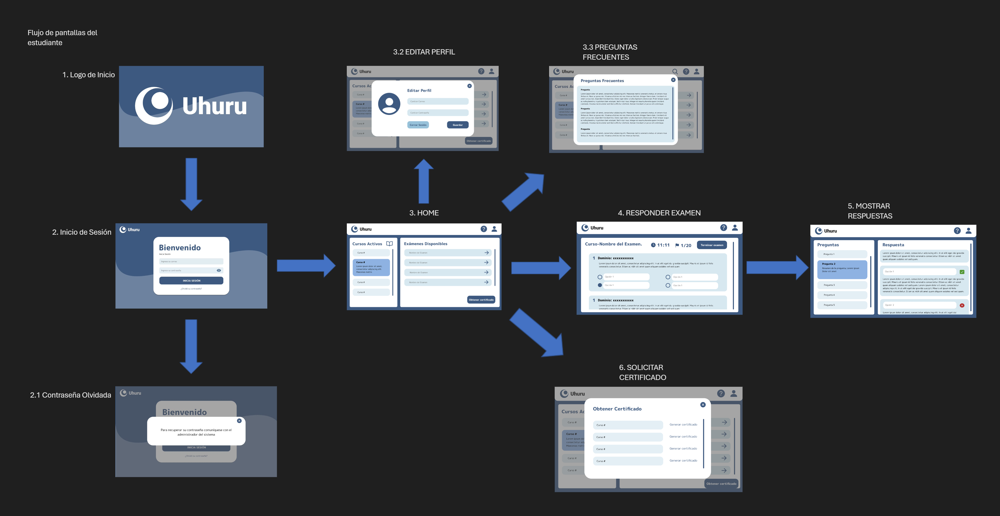
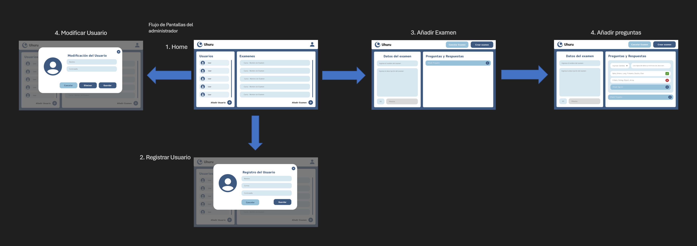

# Uhuru
Aplicación de Escritorio para gestión y práctica de exámenes de certificación.

## Integrantes
+ Cao Carlos
+ Carios César
+ Ciavato Miguel
+ Homsany Jhonatan
+ Reis Erimar

#Enlaces
1. [ Modelos de Dominio. ](#modelo_dominio)
2. [ Modelos de Casos de Uso](#use_case)
4. [ Protipos de interfaz ](#prototipos)
5. [ Modelos de Análisis](#modelo_analisis)
6. [ Modelos de Diseño](#modelo_diseño)
7. [ Librerías](#lib)
8. [ Como usar](#guia)

## Modelo del dominio
### Diagrama de clases

  

### Diagrama de estado

  

## Modelo de Casos de Uso
## Diagrama de Casos de Uso

  

### Diagrama de Estados de los casos de uso

  

### Especificaciones de los casos de uso

  
  
  

## Prototipo de pantallas
### Flujo de Usuario

### Flujo de Administrador
      
### Enlaces 
- [Prototipo Interactivo en Figma](https://www.figma.com/file/dzXOa9yDAVZmEWpZJqrHQO/Prototipo-De-Interfaz?type=design&node-id=0%3A1&mode=design&t=nIYMdCu8Bfcdtu5P-1)
- [Pantallas](docs/prototype/INTERFACE.md)

## Modelo de Análisis
### Diagrama de clases de analisis

  

### Diagrama de clases de análisis y de colaboración de casos de uso prioritarios 

#### UC1 - Crear Examen

  
  

#### UC2 - Responder Examen

  
  

#### UC3 - Obtener Certificado

  
  

### Diagrama de paquetes de análisis

  

## Modelo de Diseño
### Diagrama de clases

  

### Diagrama de secuencia

  

### Diagrama de Traza

  

### Modelo de Despliegue

  

##Librerías
Las librerías de terceros usadas en el proyecto son:
Librería  | Versión | Uso
------------- | ------------- | -------------
ItextPdf  | 5.5.9  | Proporciona las clases necesarias para estructurar y generar el archivo PDF correspondiente al certificado del Curso Aprobado.
JsonSimple  | 1.1.1  | Proporciona las herramietnas necesarias para cargar, manipular y preservar la información de los modelos a traves de archivos JSON.

##Como usar Uhuru
1. Inicia sesion con tu correo y contraseña registrados por el administrador

  

2. Selecciona uno de los cursos disponibles en la plataforma para poder acceder a los examenes asociados.

  

3. Una vez accedes al examen tendrás un tiempo limitado para responder todas las preguntas.

  

4. Al terminar el examen podrás visualizar las respuestas correctas junto con su justificación para que obtengas una correcta retroalimentación.

5. Una vez aprobado todos los examenes de un curso podrás acceder a su certificado guardandolo en formato PDF.

  

6. Desde tu perfil podrás modificar datos básicos de tu usuario.

7. Podrás acceder a las preguntas frecuentes desde tu pantalla de inicio.

